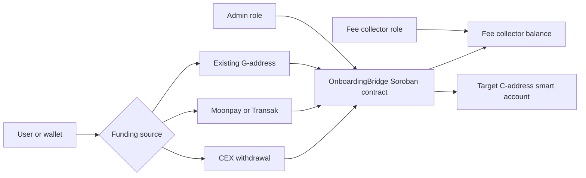
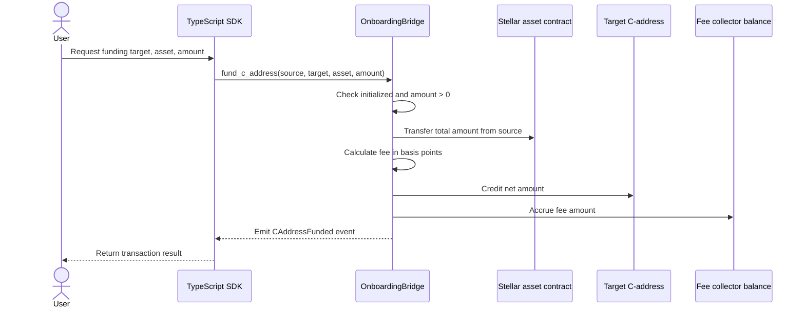
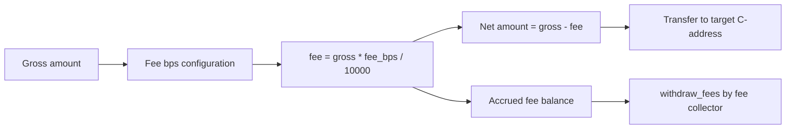
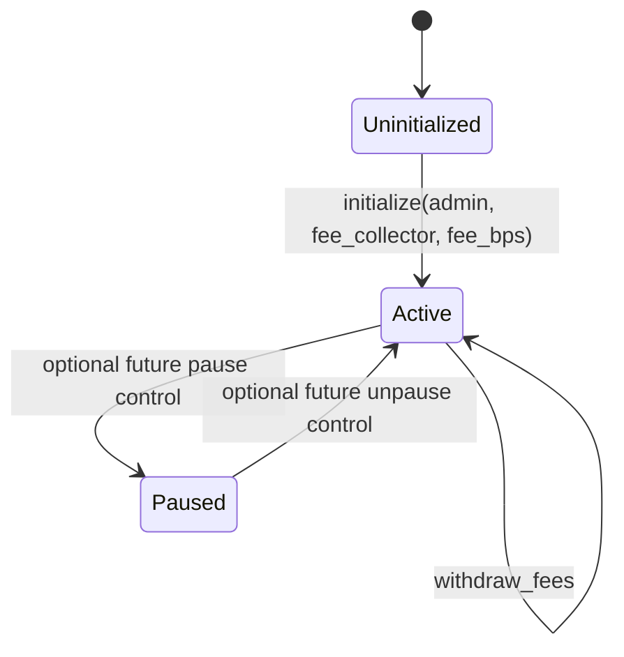

# C-Address Onboarding Bridge

A Soroban smart contract + TypeScript SDK that lets anyone fund a Soroban smart account (C-address) directly from a CEX withdrawal, a credit card, or an existing G-address without the user needing to understand the underlying account model.

## Architecture



The bridge contract is the policy boundary for routing funds to the target C-address, calculating fees, and emitting observable events. Admin actions configure bridge settings, while the fee collector can withdraw accumulated fees.

## Transaction Flows

### fund_c_address



### batch_fund_c_address


## Fee Calculation



Fees are configured in basis points. One basis point is 0.01%, and the contract caps the fee at 1000 bps, or 10%. Fees accrue in the contract and are withdrawn by the fee collector.

## Contract State



The current contract exposes initialization and active funding behavior. A paused state is shown as a possible future control point for emergency response and operational safety.

### Contract (`contracts/onboarding-bridge/`)

| Function | Description |
| --- | --- |
| `initialize` | Sets the admin, fee collector, and fee rate. |
| `fund_c_address` | Routes tokens from a source address to a C-address. |
| `batch_fund_c_address` | Funds multiple C-addresses in one transaction. |
| `set_fee_bps` / `set_fee_collector` / `set_admin` | Admin management actions. |
| `withdraw_fees` | Lets the fee collector withdraw accumulated fees. |
| `query_fee_bps` / `query_fee_collector` / `query_admin` | Reads bridge configuration. |
| `query_balance` | Reads the token balance for an address. |
| `query_is_initialized` | Checks whether the contract has been initialized. |

### SDK (`sdk/`)

- `OnboardingBridgeSDK` handles contract negotiation, transaction building, and signing handoff.
- `OffRampIntegration` handles Moonpay/Transak URL generation and CEX memo encoding.

## Quick Start

### Build the contract

```bash
cargo build -p onboarding-bridge --release
```

### Run tests

```bash
cargo test -p onboarding-bridge --features testutils
```

### Deploy to testnet

Build WASM:

```bash
cargo build -p onboarding-bridge --release --target wasm32-unknown-unknown
```

Create `deploy-config.json`:

```json
{
  "rpcUrl": "https://soroban-testnet.stellar.org",
  "networkPassphrase": "Test SDF Network ; September 2015",
  "adminSecretKey": "S...",
  "feeCollectorPublicKey": "G...",
  "feeBps": 50,
  "wasmPath": "./target/wasm32-unknown-unknown/release/onboarding_bridge.wasm"
}
```

Deploy and initialize:

```bash
npx ts-node scripts/deploy.ts all
```

## Using the SDK

```ts
import { OnboardingBridgeSDK, OffRampIntegration } from '@stellar/c-address-onboarding-bridge-sdk';

const bridge = new OnboardingBridgeSDK({
  contractId: 'C...',
  rpcUrl: 'https://soroban-testnet.stellar.org',
  networkPassphrase: 'Test SDF Network ; September 2015',
});

const result = await bridge.fundCAddress(
  { source: 'G...', target: 'C...', asset: 'C...', amount: '1000' },
  sourceKeypair,
);

const offramp = new OffRampIntegration({ testMode: true });
const moonpayUrl = offramp.getMoonpayUrl({
  targetCAddress: 'C...',
  amount: '100',
  currency: 'XLM',
});

const memo = offramp.generateCEXDepositMemo('C...');
```

## Events

- `CAddressFunded` is emitted for each funding or batch transfer.
- `FeesWithdrawn` is emitted when fees are withdrawn.

## License

MIT
