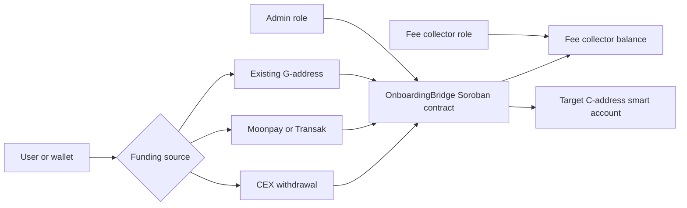
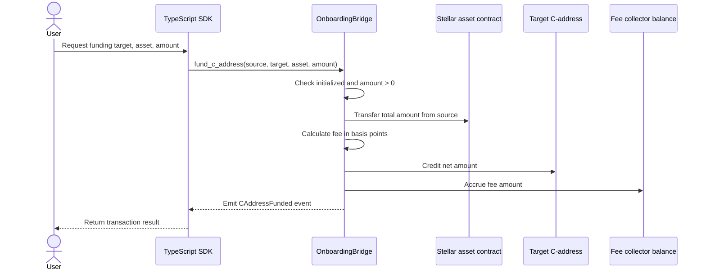
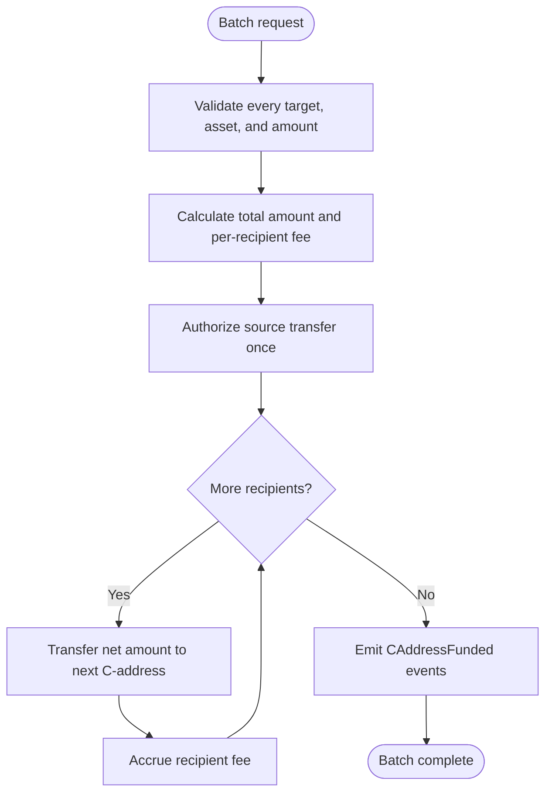
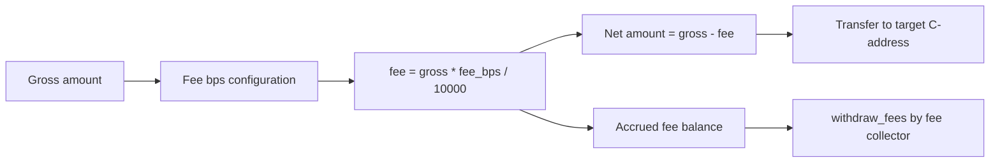
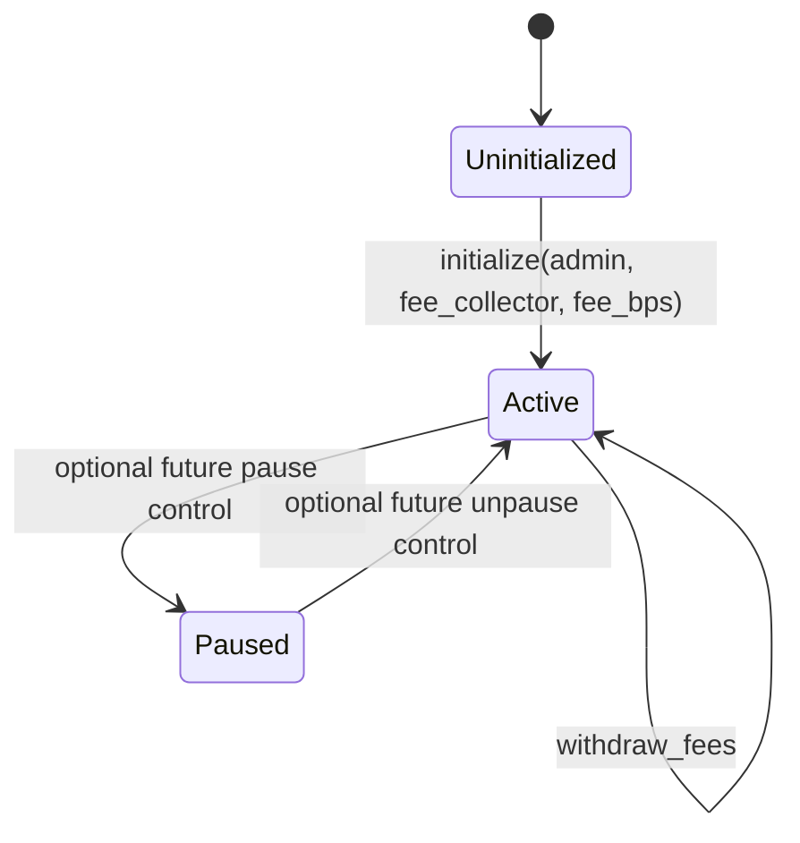

# C-Address Onboarding Bridge

A Soroban smart contract + TypeScript SDK that lets anyone fund a Soroban smart account (C-address) directly from a CEX withdrawal, a credit card, or an existing G-address without the user needing to understand the underlying account model.

## Architecture



The bridge contract is the policy boundary for routing funds to the target C-address, calculating fees, and emitting observable events. Admin actions configure bridge settings, while the fee collector can withdraw accumulated fees.

## Transaction Flows

### fund_c_address



### batch_fund_c_address



## Fee Calculation



Fees are configured in basis points. One basis point is 0.01%, and the contract caps the fee at 1000 bps, or 10%. Fees accrue in the contract and are withdrawn by the fee collector.

## Contract State



The current contract exposes initialization and active funding behavior. A paused state is shown as a possible future control point for emergency response and operational safety.

### Contract (`contracts/onboarding-bridge/`)

| Function | Description |
| --- | --- |
| `initialize` | Sets the admin, fee collector, and fee rate. |
| `fund_c_address` | Routes tokens from a source address to a C-address. |
| `batch_fund_c_address` | Funds multiple C-addresses in one transaction. |
| `set_fee_bps` / `set_fee_collector` / `set_admin` | Admin management actions. |
| `withdraw_fees` | Lets the fee collector withdraw accumulated fees. |
| `query_fee_bps` / `query_fee_collector` / `query_admin` | Reads bridge configuration. |
| `query_balance` | Reads the token balance for an address. |
| `query_is_initialized` | Checks whether the contract has been initialized. |

### SDK (`sdk/`)

- `OnboardingBridgeSDK` handles contract negotiation, transaction building, and signing handoff.
- `OffRampIntegration` handles Moonpay/Transak URL generation and CEX memo encoding.

## Quick Start

### Build the contract

```bash
cargo build -p onboarding-bridge --release
```

### Run tests

```bash
cargo test -p onboarding-bridge --features testutils
```

### Deploy to testnet

Build WASM:

```bash
cargo build -p onboarding-bridge --release --target wasm32-unknown-unknown
```

Create `deploy-config.json`:

```json
{
  "rpcUrl": "https://soroban-testnet.stellar.org",
  "networkPassphrase": "Test SDF Network ; September 2015",
  "adminSecretKey": "S...",
  "feeCollectorPublicKey": "G...",
  "feeBps": 50,
  "wasmPath": "./target/wasm32-unknown-unknown/release/onboarding_bridge.wasm"
}
```

Deploy and initialize:

```bash
npx ts-node scripts/deploy.ts all
```

## SDK Integration Guide

Install the SDK package in your application and keep the network settings aligned with the deployed contract:

```bash
npm install @stellar/c-address-onboarding-bridge-sdk @stellar/stellar-sdk
```

### Basic integration

```ts
import { Keypair, Networks } from '@stellar/stellar-sdk';
import { OnboardingBridgeSDK, OffRampIntegration } from '@stellar/c-address-onboarding-bridge-sdk';

const bridge = new OnboardingBridgeSDK({
  contractId: 'CA...',
  rpcUrl: 'https://soroban-testnet.stellar.org',
  networkPassphrase: Networks.TESTNET,
  adminKeypair: Keypair.fromSecret(process.env.ADMIN_SECRET_KEY!),
});
```

Use `Networks.TESTNET` and testnet contract IDs for development. Switch to `Networks.PUBLIC`, production RPC infrastructure, and production contract IDs only after deployment and monitoring are ready.

### Fund a C-address

```ts
const result = await bridge.fundCAddress({
  source: 'GA...',
  target: 'CC...',
  asset: 'CD...',
  amount: '10000000', // 10 USDC when the asset uses 7 decimals
});

console.log('submitted transaction', result.hash);
```

Amounts should be passed in stroop-style integer strings that match the token precision used by the contract and token client. Validate the source G-address, target C-address, asset contract ID, and network before prompting a user to sign.

### Off-ramp integration

```ts
const offramp = new OffRampIntegration({
  moonpayApiKey: process.env.NEXT_PUBLIC_MOONPAY_API_KEY,
  transakApiKey: process.env.NEXT_PUBLIC_TRANSAK_API_KEY,
  testMode: true,
});

const moonpayUrl = offramp.getMoonpayUrl({
  targetCAddress: 'CC...',
  amount: '100',
  currency: 'USDC',
});

const cexMemo = offramp.generateCEXDepositMemo('CC...');
```

Use provider test keys while developing. Treat generated URLs and memos as user-facing routing data: display them clearly, make them copyable, and warn users to verify the destination before sending funds.

### Error handling

```ts
try {
  const result = await bridge.fundCAddress({
    source: 'GA...',
    target: 'CC...',
    asset: 'CD...',
    amount: '10000000',
  });
  return result.hash;
} catch (error) {
  const message = error instanceof Error ? error.message : 'Unknown bridge error';
  console.error('C-address funding failed', { message, error });
  throw new Error('Unable to fund C-address: ' + message);
}
```

Handle user rejection, invalid addresses, RPC timeouts, insufficient balances, paused contracts, and authorization failures separately in product UI when possible. Do not expose private keys, raw secrets, or full provider responses in client-facing error messages.

### Event listening

Index contract events to reconcile funding state after submission:

```ts
// Pseudocode: use your Soroban RPC/event indexer client to watch contract events.
const events = await bridge.getEvents?.({
  contractId: 'CA...',
  topic: 'CAddressFunded',
  fromLedger: lastProcessedLedger,
});

for (const event of events ?? []) {
  console.log('funding event', event);
}
```

If your SDK version does not expose an event helper, query Soroban RPC directly or use an indexer. Persist the last processed ledger so retries do not duplicate user notifications.

### Best practices

- Keep contract ID, RPC URL, network passphrase, and provider API keys in environment-specific configuration.
- Use testnet for integration tests and never reuse production admin keys in local development.
- Confirm that the signer, source address, token contract, and bridge contract all belong to the same network.
- Surface transaction hashes and explorer links to users after submission.
- Reconcile final status from events or ledger reads instead of assuming a submitted transaction completed the business flow.
- Keep CEX memos and off-ramp URLs short-lived where providers support expiration.

## Events

- `CAddressFunded` is emitted for each funding or batch transfer.
- `FeesWithdrawn` is emitted when fees are withdrawn.

## License

MIT
